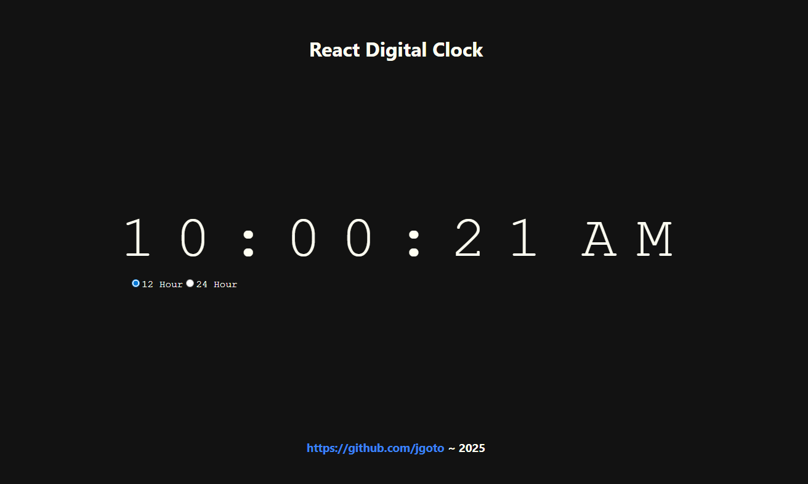
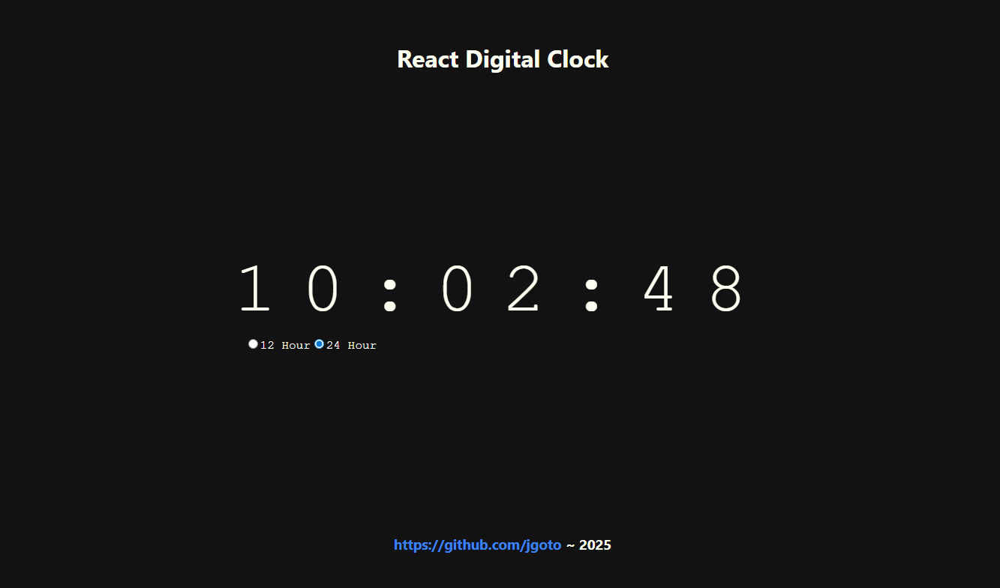

# 🕒 React Digital Clock

**Last updated:** June 10, 2024

## Overview

The **React Digital Clock** is a minimalist web app built with React, demonstrating responsive design principles and clean UI implementation. This project is a lighthearted, overengineered response to the age-old question: _"What time is it?"_

## Features

- ⏰ Real-time updating digital clock  
- 🌓 Toggle between 12-hour and 24-hour formats  
- 📱 Responsive layout for desktop and mobile  
- 💡 Simple, accessible, and styled with minimalism in mind  

## Tech Stack

- **React**  
- **JavaScript**  
- **CSS Modules**

## Screenshots

### 12 Hour Clock

### 24 Hour Clock

